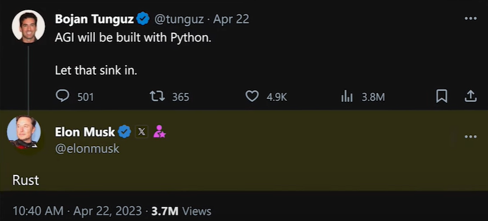

# Rust introduction

```rust
fn main() {
    println!("Hello, world!");
}
```

There is a lot of new languages created in the last 20 years:
- **Rust (2010)**: Systems programming language known for its focus on safety and performance.
- **Kotlin (2011)**: Statically-typed language designed to interoperate with Java and used for Android development.
- **Dart (2011)**: Developed by Google for building web, mobile, and desktop applications.
- **Swift (2014)**: Apple's programming language for iOS, macOS, watchOS, tvOS, and Linux development.
- **Hack (2014)**: A language by Facebook that adds static typing to PHP and introduces other features for improved development.
- **Elm (2012)**: Functional programming language for front-end web development, compiling to JavaScript.
- **Julia (2012)**: High-level, high-performance language for technical computing.
- **Crystal (2014)**: Statically typed language with a focus on speed and Ruby-like expressiveness.
- **Odin (2018)**: Systems programming language designed for speed and ease of use.
- **Jai (2020)**: Created by Jonathan Blow, Jai is a programming language designed for game development with an emphasis on performance and expressiveness.
- **Ballerina (2017)**: A language designed for integration and building networked applications.
- **Pony (2015)**: Statically-typed, actor-based language designed for high performance and fault tolerance.
- **Red (2011)**: A programming language that descends from Rebol, known for its simple and human-readable syntax.
- **Eta (2016)**: Functional programming language for the Java Virtual Machine (JVM), inspired by Haskell.
- **Haxe (2005, but gained prominence in the last 20 years)**: Cross-platform language that can compile to various target languages.
- **Purescript (2013)**: A strongly-typed functional programming language that compiles to JavaScript.
- **V (2018)**: A systems programming language designed for simplicity and safety.
- **Ceylon (2011)**: A language for the Java Virtual Machine (JVM) with a focus on modularity.
- **Futhark (2014)**: A purely functional data-parallel programming language for high-performance GPU computing.
- **Starlark (2018)**: A configuration language designed for use with the Bazel build system.

So ... why would you learn rust?

## Hype
### The most loved language
At least according to Stack Overflow survey. For seven years straight.


### Big companies are adopting
**Microsoft** - yes, Windows codebase is rewritten in Rust. The main argument for adopting Rust at Microsoft was the memory safety that Rust provides. For the last 12 years, around 70 percent of the CVEs (Common Vulnerabilities and Exposures) discovered at Microsoft have been connected with memory safety. Microsoft has tried various options to solve this issue, such as extensive developer training and static analysis tools. However, it seems like the only way out is to make these vulnerabilities impossible to do.

**Facebook** - Facebook used Rust to rewrite its source control backend, which was written in Python. They were looking for a compiled language to rewrite it in and were attracted to Rust because of its safety benefits.

**Amazon** - AWS has used Rust for performance-sensitive components of services like Lambda, EC2, and S3. In addition, the company openly supports and sponsors the development of the language and its ecosystem.

**Discord** - Discord uses Rust in multiple places of their codebase, both on the client- and the server-side.

### Linux
Yes, Rust was added to Linux as a second programming language for Linux kernel after C. Let that sink in - not even C++ had this privilege.
https://en.wikipedia.org/wiki/Rust_for_Linux

### Future of AI

Yeah, that happen

### Blazingly fast
And cheap. You can be a hero and save the environment!
Benchamark by AWS:


### You can write everything in Rust
- Servers
- Desktop applications
- Mobile applications and IoT
- WebAssembly. Yes, not need for JavaScript anymore
- Games
- AI

## The compiler is your best friend

### No errors
Let see some errors from all favorite language: Java Script
```javascript
let spam = ['cat', 'dog', 'mouse']
console.log(spam[6])

// no output, no errors, spam[6] is `undefined`
```

### Terrible errors
```python
spam = ['cat', 'dog', 'mouse']
print(spam[6])
```
The output is:
```bash
Traceback (most recent call last):
  File "segfaults.py", line 2, in <module>
    print(spam[6])
IndexError: list index out of range
```

### Rust way
Let's check how it handles the same situation
How helpful is rust compiler?
- Example with vector
- Example with print

## The Borrow Checker
Has two rules:
- Data has one owner
- Data may have multiple readers or one writer

That's all. And it solves all the problems with memory management.
But it's harder then it looks.

### Example
- Moving ownership
- Borrowing
- Mutation

### Lifetimes
- Life gets harder now

## No more nulls!

```javascript
typeof null          // "object" (not "null")
typeof undefined     // "undefined"
null === undefined   // false
null  == undefined   // true
null === null        // true
null  == null        // true
!null                // true
isNaN(1 + null)      // false
isNaN(1 + undefined) // true
```

## Learning curve
